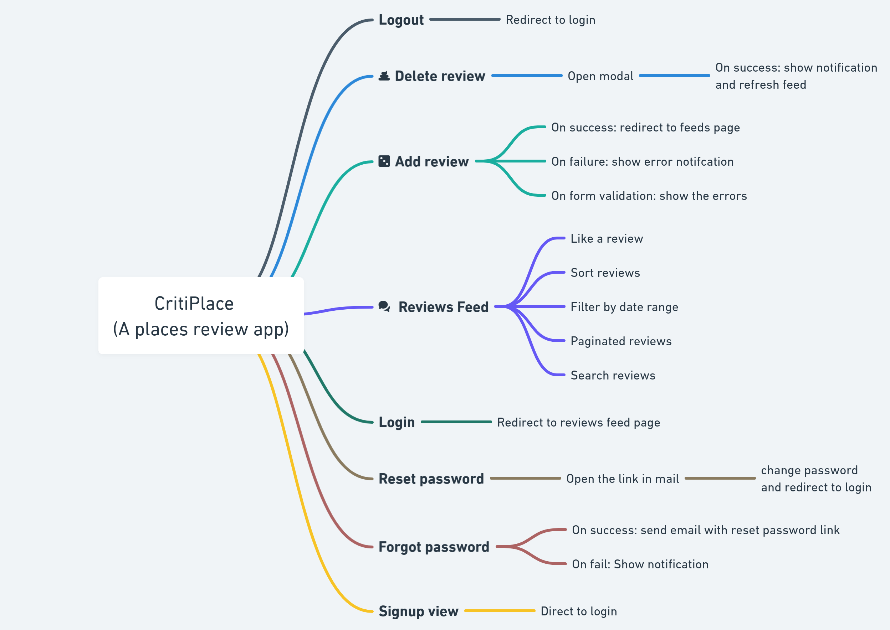

## TDD With Cypress

Heads up!! You DON'T need to test all your apps. Testing is a mindset and knowing what to test and how to test makes all the difference.
Now with that out of the way, let's get started.

Cypress is a great tool for TDD. It allows you to write tests before you write the code. This is a great way to ensure that you are writing the right code.

Understanding how to test an application's various paths (or components) is the most challenging part of testing.
While building full stack applications, the best practice is to have `unit test` and `integration tests` for the backend while the frontend is being developed. Once the frontend is ready we can start E2E testing.

### Defining the Testing Strategy.

The best practice for this would be to visually document the application's most important areas for test coverage. A recommended approach would be to first document all the application screens, taking notes on the functionality that needs to be tested on each.

For example this is how a visual document for a places review app might look like:



Thinking through your application upfront makes writing your tests much more straightforward.

The next step is to test **"user journeys"** which will test the most critical flows in your application. This is where you will be testing the most important parts of your application.

### Ways to create data for your tests

The 2 best methods to create data for your tests are:

- Call special API endpoints to create data, the main advantage of this method is that we can ensure relationships between various entities are established.

- Using `factory` scripts to create database seeds.
  We can use the `cy.exec` command to run the factory scripts and create the data we need using **`faker.js`**.

```js
// generateSeedUsers.js

import path from 'path';
import fs from 'fs';
import shortid from 'shortid';
import faker from 'faker';
import bcrypt from 'bcryptjs';
import { times } from 'lodash';

const passwordHash = bcrypt.hashSync('s3cret', 10);

const createFakeUser = () => ({
  id: shortid(),
  firstName: faker.name.firstName(),
  lastName: faker.name.lastName(),
  username: faker.internet.userName(),
  password: passwordHash,
  email: faker.internet.email(),
  createdAt: faker.date.past(),
  modifiedAt: faker.date.recent(),
});

export const createSeedUsers = (numberOfUsers) =>
  times(numberOfUsers, () => createFakeUser());

export const saveUsersSeed = (numberOfUsers) => {
  const seedUsers = createSeedUsers(numberOfUsers);
  // write seed users to seedUsers.json
  fs.writeFile(path.join(process.cwd(), 'seedUsers.json'), seedUsers);
};

saveUsersSeed(10);
```

In this example, we have a simple script that creates fake users and then writes those users to a **`.json`** file. You could then use this **`.json`** file as a fixture to drive some of your tests, or you could use this script to write the users to your test database, etc.

Learn more creating data for your tests [here](https://learn.cypress.io/advanced-cypress-concepts/database-initialization-and-seeding#creating-database-seeds-with-factory-scripts).

### Testing the most important flows

The most important flows in your application are the ones that are most likely to be used by your users. These are the flows that you should be testing first.

For example, in the case of a places review app, the most important flows would be:

- Registering a new user
- Logging in a user
- Adding a new review
- Deleting a review
- Liking a review

### Fixtures

Fixtures are a great way to store data that you can use in your tests. You can store data in a fixture as a JSON object, a JSON array, or as a string. You can also store binary data such as images, PDFs, etc.

Fixtures are stored in the `cypress/fixtures` directory. You can create subdirectories within the `cypress/fixtures` directory to organize your fixtures.

You can access fixtures using the `cy.fixture()` command. This command takes the path to the fixture as an argument and returns a promise that resolves with the contents of the fixture.

```js
// cypress/fixtures/users.json

[
  {
    id: '1',
    firstName: 'Pravunath',
    lastName: 'Singh',
  },
  {
    id: '2',
    firstName: 'John',
    lastName: 'Doe',
  },
];

// cypress/integration/users.spec.js

describe('Users', () => {
  it('should get all users', () => {
    cy.fixture('users').then((users) => {
      cy.request('GET', '/api/users').then((response) => {
        expect(response.status).to.eq(200);
        expect(response.body).to.deep.eq(users);
      });
    });
  });
});
```

Here we are using the `cy.fixture()` command to get the contents of the `users.json` fixture and then using the `cy.request()` command to make a request to the `/api/users` endpoint. We then assert that the response status is `200` and that the response body is equal to the contents of the `users.json` fixture.

### Difference between fixtures and factories

Fixtures are used to store data that you can use in your tests. Factories are used to create data that you can use in your tests.
Fixtures are useful when you have predefined data that you want to use across multiple tests.

On the other hand, factory scripts are modules that generate dynamic test data on the fly. They can be useful when you need to generate unique data for each test or simulate complex data scenarios.

### Difference between `cy.request` and `cy.intercept`

In Cypress, `cy.request` and `cy.intercept` are two methods that allow us to interact with network requests. Here are some guidelines for when to use each method:

- Use `cy.request` when you want to make a real HTTP request to your server instead of mocking the response. This is useful for testing server-side responses and verifying network connectivity.
  For example

```js
cy.request('POST', '/api/login', {
  username: 'testuser',
  password: 'password123',
}).then((response) => {
  expect(response.status).to.equal(200);
});
```

- Use `cy.intercept` when you want to mock a response to a network request. This is useful for testing client-side responses and simulating network errors. You can also use this method to modify the request before it is sent to the server and modify the response before it is returned to the client.
  For example

```js
cy.intercept('/api/cart-items', [
  {
    item_name: 'test item',
    item_description: 'this is a test item',
    item_price: 10.99,
    item_quantity: 2,
  },
]).as('cartItems');

cy.visit('/cart');

cy.wait('@cartItems');

cy.get('.cart-item').should('have.length', 1);
cy.contains('test item').should('exist');
cy.contains('this is a test item').should('exist');
cy.contains('$10.99').should('exist');
cy.contains('2').should('exist');
```

You can learn more about the testing strategies you can use with `cy.request` and `cy.intercept` [here](https://docs.cypress.io/guides/guides/network-requests.html#Testing-Strategies).

In general it is recommended to use `cy.intercept` for most of your tests. This is because `cy.intercept` is faster than `cy.request` and it is easier to mock responses with `cy.intercept`. But there should be one **real** E2E test that uses `cy.request` to make sure that your server is working and sending responses as expected, this will be the **happy path** test.

### Using custom commands

Custom commands are a great way to encapsulate common functionality that you use in your tests. You can create custom commands using the `Cypress.Commands.add()` method. One of the most common use case for custom commands would be to get elements by their `data` attribute.

```js
// normally this is how a test would look like without a custom command

cy.get('[data-cy=login-form]').within(() => {
  cy.get('[data-cy=username]').type('testuser');
  cy.get('[data-cy=password]').type('password123');
  cy.get('[data-cy=submit]').click();
});

// writing `[data-cy=login-form]` over and over again is not very DRY
// so we can create a custom command to encapsulate this functionality

Cypress.Commands.add('getByDataCy', (selector) => {
  return cy.get(`[data-cy=${selector}]`);
});

// now we can use our custom command in our tests

cy.getByDataCy('login-form').within(() => {
  cy.getByDataCy('username').type('testuser');
  cy.getByDataCy('password').type('password123');
  cy.getByDataCy('submit').click();
});
```

You can learn more about custom commands [here](https://docs.cypress.io/api/cypress-api/custom-commands.html#Syntax).

### Setting up Custom Commands in TypeScript

If you are using TypeScript, you can set up custom commands by creating a `cypress/support/index.d.ts` file and adding the following code:

```ts
/// <reference types="cypress" />

declare namespace Cypress {
  interface Chainable {
    getByDataCy(selector: string): Chainable<Element>;
  }
}
```

This will allow you to use the `getByDataCy` command in your tests without getting any TypeScript errors. You can also add other custom commands to this file.

### Using `cy.task` to run Node.js code

Cypress provides a `cy.task` command that allows you to run arbitrary Node.js code from within your tests. This is useful for running tasks that are generally not supported by Cypress such as file system operations, database operations, etc.
Their most common use cases are:

- Reading and writing files
- Running shell commands
- Performing database operations, like resetting and seeding the database before each test

Here is an example of how you can use `cy.task` reset and seed a database before each test:

```js

// cypress/tasks/resetDB.js

import prisma from '../../src/prisma';

const resetDB = async () => {
  await prisma.user.deleteMany();
  return null
};

export default resetDB;

// cypress/tasks/seedDB.js

import prisma from '../../src/prisma';

const seedDB = async () => {
  await prisma.user.createMany({
    data: [
      {
        id: '1',
        firstName: 'Rahul',
        lastName: 'Singh'
      },
      {
        id: '2',
        firstName: 'John',
        lastName: 'Doe'
      }
    ]
  });
  return null
};

export default seedDB;

// now in your cypress.config.js file

import resetDB from './cypress/tasks/resetDB';
import seedDB from './cypress/tasks/seedDB';

module.exports = {
  ...
  taskTimeout: 10000,
  setupNodeEvents(on, config) {
    on('task', {
      resetDB
      seedDB
    });
  }
};

// now you can use these tasks in your tests

beforeEach(() => {
  cy.task('resetDB');
  cy.task('seedDB');
});

```

### Testing responsive layouts

Cypress provides a `cy.viewport()` command that allows you to set the viewport size of the browser window. This is useful for testing responsive layouts. Here is an example of how you can use `cy.viewport()` to test a responsive layout:

```ts
context('check for responsiveness', () => {
  it('check if the links are hidden on mobile and are visible on desktop.', () => {
    cy.viewport('iphone-6');
    cy.getByDataCy('navbar-container').within(() => {
      cy.getByDataCy('links').should('not.be.visible');
    });
    cy.viewport('macbook-15');
    cy.getByDataCy('navbar-container').within(() => {
      cy.getByDataCy('links').should('be.visible');
    });
  });

  it('check if the hamburger is visble on mobile and not visible on desktop', () => {
    cy.viewport('iphone-6');
    cy.getByDataCy('navbar-container').within(() => {
      cy.getByDataCy('hamburger').should('be.visible');
    });
    cy.viewport('macbook-15');
    cy.getByDataCy('navbar-container').within(() => {
      cy.getByDataCy('hamburger').should('not.be.visible');
    });
  });

  it('click on the hambuger, open the drawer and check if the links are visible', () => {
    cy.viewport('iphone-6');
    cy.getByDataCy('navbar-container').within(() => {
      cy.getByDataCy('hamburger').click();
    });
    cy.getByDataCy('drawer').within(() => {
      cy.getByDataCy('drawer-links').should('be.visible');
      cy.getByDataCy('drawer-links').children().should('have.length', 4);
    });
  });
});
```

### Arranging tests using `describe` and `context`

In Cypress, both **`describe`** and **`context`** are used to group test cases and help organize your test suite. The main difference between **`describe`** and **`context`** is in how they're named and what they represent.

**`describe`** is used to group together related test cases. It's typically used for describing the behavior of a single unit or component, and typically contains multiple it blocks:

```js
describe('MyComponent', () => {
  it('renders correctly', () => {
    // ...
  });

  it('behaves as expected when clicked', () => {
    // ...
  });

  it('works with different input values', () => {
    // ...
  });
});
```

The name of the **`describe`** block should **`describe`** what is being tested, such as the name of a component or a specific feature. In the example above, we're testing a component called **`MyComponent`**, and the **`it`** blocks inside **`describe`** the different scenarios that might occur.

**`context`**, on the other hand, is used to group together tests that share common context or setup. It's typically used for describing the same behavior or flow with different initial states or inputs:

```js
describe('MyComponent', () => {
  context('when initial value is 0', () => {
    it('increments value when clicked', () => {
      // ...
    });
  });

  context('when initial value is greater than 0', () => {
    it('decrements value when clicked', () => {
      // ...
    });
  });
});
```

### Topics for R&D

- [ ] Testing OAuth flows
- [ ] Testing GraphQL APIs
- [ ] Testing Uploading Files
- [ ] Mocking APIs using MSW
- [ ] Using Cypress in CI/CD

### Resources

- [MailSlurp (Useful for Email testing - Reset Password feature)](https://www.mailslurp.com/)
- [Test Design Techniques](https://medium.com/10-minutes-qa-story/test-design-techniques-cheetsheet-26546c4271c2)
- [Don't use fixtures in Cypress](https://dev.to/dgreene1/don-t-use-fixtures-in-cypress-and-unit-tests-use-factories-5cnh)
- [Guide on network requests](https://docs.cypress.io/guides/guides/network-requests)
- [Gottcha's with Cypress](https://glebbahmutov.com/blog/)
- [A complete guide to testing with cypress (series of blogs)](https://dev.to/walmyrlimaesilv/series/11377)
- [Testing Next.js with Cypress](https://blog.logrocket.com/end-to-end-testing-next-js-apps-cypress-typescript/)
- [Gottcha's with Cypress and Next.js](https://blog.byndyusoft.com/testing-next-js-website-with-cypress-a8475fd087e2)

### Guidelines for moving towards TDD

- Discuss if a project is a good candidate for TDD
- If NO, then follow the same process which we have been following till now.
- If YES, then follow the following steps:

  - Create a Visual flow of the entire application using [Whimsical](https://whimsical.com/) or [Figma](https://www.figma.com/), highlighting the most critical flows of the application.
  - The Backend Team will create a list of all the API's that will be used in the application, the data schema and the expected responses. The backend team will then provide that doc to the Frontend Team.
  - The Frontend team will setup MSW, create factory scripts and generate mock data for all the API's that will be used in the application.
  - While the backend is being developed, the frontend team will start with the design conversion and will start writing tests by using the mock API server, test all the critical flows of the application.
  - Once the backend is ready, start integration and writing final E2E tests. No need to test for all the edge cases

- Note 1: This is a very high level overview of the process. The actual process will be discussed with the team and will be customized based on the project requirements.

- Note 2: If at any point of time, that API's, the data schema or the scope of the project changes, the teams should coordinate and update the mock API server and the tests accordingly. This will prevent the creation of flaky tests.
